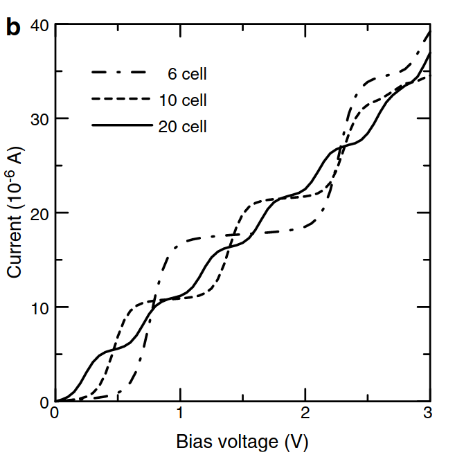

### Experimental setup

- The CNT ~ 6.5 micrometers long. ~ 0.5 micrometer in the middle will be suspended in air. 3 micrometer on either sides will be suspended above Pt surfaces. The Pt surfaces are mobile, allowing application of strain to the middle region.
- Chirality aka (n,m) values? - Experimentally this is difficult to determine. The only possible information we will obtain is if the CNT is armchair or zig-zag
- The diameter of the CNT will lie ~0.2 nm to 2 nm.

  - Based on this info, I will try to estimate the chiral indices

    - Armchair CNT aka chiral index (n,n) ---> d = a*sqrt(3)*n/pi
    - Zig-zag CNT aka chiral index (n,0) ---> d = a\*n/pi

    where `a` is the lattice constant of graphene (~ 2.46 Angstrom or 0.246 nm)

    - Armchair chiral index could lie between [1,14]
    - Zig-zag chiral index could lie between [2,25]

### Lammps setup for structure relaxation

- Simulations from literature suggests that relaxation is fairly independent of diameters upto 6.7 nm (Electronic properties of zigzag carbon nanotubes under uniaxial strain). We could therefore focus on a diameter of 1 nm (approximately middle of the possible experimental CNT diameter values) and assume that it is valid for all CNTs in 0.2 to 2 nm range. Simulations from literature also suggest the armchair CNTs remain metallic throughout the range of tested strains whereas zig-zag show metallic to semiconductor transitions.
- Since I'm unaware of the specific applications of the experimental setup, I will focus on zig-zag for now.
- For the ease and speed of testing of initial studies, I built a (6,0) CNT which corresponds to ~0.47 nm diameter.

### Hamiltonian setup for strained hopping parameters

- Hopping is scaled by a simple distant dependent exponential function. May or may not be enough.
- sp2 hybridization effects have been reported to be important in CNTs due to their curvature. It is currently ignored but can be added later.
- Whether this needs to be done through dft or by adding terms to the TB Hamiltonian can be explored.
- The effect of Pt has not been included.

### Size considerations for the scattering region and leads

- Our leads are unstrained CNTs
- Our scattering region is the strained CNT with a few unstrained layers on either ends to couple to the leads.
- Since we will not attempt to model our device to be 6.5 micrometers long, here are some size considerations

  - A finite repetition of unit cells of the leads to compute the recursive GF and the leads self-energy to incorporate the effect of the 3 micrometer long leads on either side.
  - The scattering region contains a total of 30 repetitions of the unit cell (~ 12.7 nm long <<< 0.5 micrometers). It may be interesting to study if this finite size has an effect on calculated transport quantities. However, in an initial test run, I think this is a good length due to the following. The paper "Electronic properties of zigzag carbon nanotubes under uniaxial strain" obtains the following plot for current vs bias voltage where the steps in current due to quantum size effects starts smoothing out as one increases the number of unit cells. For a CNT of the order of 0.5 micrometer, the steps should become denser such that the profile resembles a smooth curve.

  
